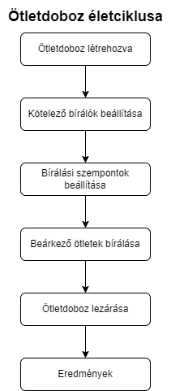

# Multitenant ötletkezelő alkalmazás Spring alapokon - Beszámoló

Diplomatervezés 1 - 2023/24/1

Varga Ádám Marcell

Konzulens: Forstner Bertalan

<hr>

## **Tartalom**

- [Bevezetés](#bevezetés)
- [Pontozási rendszer](#pontozási-rendszer-megvalósítása)
- [Logolás](#loglás)
- [Security](#security)
- [DevOps feladatok](#devOps-feladatok)
- [Továbbfejlesztési lehetőségek](#továbbfejlesztési-lehetőségek)

<div style="page-break-after: always;"></div>

## **Bevezetés**

A félévben a már Önálló laboratórium 2 tárgy keretében elkezdett Multitenant ötletkezelő alkalmazást fejlesztettem tovább. Ennek a beszámolója [itt](./onlab_1_beszamlo_Varga_Adam.md) található

A félév során a legnagyobb feladat az előző félévben bonyolultság miatt elmaradt pontozási rendszer implementálása volt. Emeleltt elkezdtem a project DevOps feladataival is foglalkozni, illetve a tesztelést és logolást is előkészítettem.

## **Pontozási rendszer megvalósítása**

A pontozási renszer az önálló laboratórium 2 tárgy keretében kimaradt az implementálásból, mivel a félév végén már nem volt idő a kielégítő implementációra. A funkció terve a következő volt:



Ez a terv alapján kezdtem el a félévben a pontozás megvalósítását.

**Ötletdobozok változásai**

Az új tervben szerepel, hogy az ötletdobozokhoz ki kell választanunk kötelező bírálókat. Ezeket a bírálókat az ötletdoboz default bírálókként kezeli, ezt később meg lehet változtatni. Az ötletdobozon belül minden ötletnek ezek a birálók default bírálói lesznek. Ötletenként lehet bővíteni ezt a listát is.

Ezzel a megoldással a nem kell minden ötletet külön felparaméterezni bírálókkal, de meg van rá a lehetőségünk. Emellett a bírálóknak sokkal könnyebb átlátni a személyes oldalukon, hogy milyen ötletdobozokhoz illetve ötletekhez lettek párosítva, és hogy a dobozok lezárta után miket kell majd pontozniuk.

Az ötletdobozok másik nagy változása az új bírálási szempontok beállításának lehetősége. Az új rendszerben az ötletdobozok létrehozásakor a dobozok még nem jelennek meg a felhasználóknak a főoldalon, mivel draft státuszban vannak. A draft státuszt az admin felhasználók tudják feloldani azzal, hogy pontozási/értékelő lapot fűznek az ötletdobozhoz. Amint megtörténik az ötletdoboz pontozási lapjának csatolása elérhetővé válik a felhasználóknak az ötletek létrehozására.

Az pontozási lapot az admin felhísználók a saját oldalukon hozhatják létre. Ezen az oldalon egy listában jelennek meg azok az ötletdobozok, amik draft státuszban állnak. Egy ötletdobozt kiválasztva dinamikusan állíthatunk be az ötletdobozhoz pontozási metrikákat. A pontozás úgy működik, hogy bizonyos szempontok szerint lehet értékelni az ötletdobozt. A szempontoknak lehet megnevezése, leírása, pontozási típusa és pontszáma

A metrikák a következők:

- **STAR** Ez egy csillagos pontozási forma. 1-5 csillaggal lehet értékelni az adott ötletet.
- **SLIDER** Ez egy csúszkás értékelési rendszer, ahol 1-10ig lehet értékelni az adott ötletet.
- **OTHER** Ez egy sztöveg alapú értékelés, itt nincs pontszámítás.

A pontozási metrikák bevitele után az ADMIN elmenti a pontozási lapot a kiválasztott Ötletdobozhoz, ezzel véglegesítve azt. Ezen a ponton az ötletdoboz megnyílik, és bármely bejelentkezett felhasználó létrehozhat az ötletdobozba ötleteket. A pontozási útmutatót meg lehet nézni az ötletdoboz oldalán is a létrehozás után.

Abban az esetben, ha az ötletdobozhoz hozzá van adva az adott ADMIN vagy JURY felhasználó, akkor megjelenik a saját oldalán a pontozandó ötletek listájában a beérkező ötletek. Ezeket a bírálók akármikor értékelhetik.

Az értékelés során az ötletet a megadott szempontok szerint kell értékelni. Minden szempontot figyelembe kell venni és ki kell tölteni a megfelelő metrikákat alkalmazva. Az értékelés után a bíráló már nem fér hozzá ehez az értékeléshez. Az értékelt ötleteket a bírálók a saját oldalukon nézhetik meg.

Ha egy ötlethez minden előre beállított default bíráló leadja az értékelését, akkor az automatikusan átkerül a REVIEWED oszlopba az ötletdoboz képernyőn. Ekkor az admin megnézheti a kiértékelő lapot, amin a beérkezett értékelések összesítve vannak. Itt minden szempont szerint átlagolva vannak külön külön a pontszámok. Ez az összegző lap alapján az ADMIN vagy elfogadja, vagy elutasítja az ötletet. E döntés hatására az ötlet a dobozban a megfelelő oszlopba kerül és az ötlet lezárul.

### **Új adatszerkezet**

Több Modelben is változtatásokat kellett eszközölni, hogy a pontozási rendszer helyesen és dinamikusan működjön.

A megváltoztatott modellek:

- **User**

  - **scoreSheets: ScoreSheet[]** Ez a kollekció tárolja a felhasználó által készített pontozásokat.

  - **requiredToJury: IdeaBox[]** Ez a kollekció tárolja azokat az ötletdobozokat, ahol a felhasználó bírálónak lett beállítva.

  Ez a két új elem nyilván csak a JURY és ADMIN felhasználókon van értelmezve.

- **IdeaBox**

  - **defaultRequiredJuries: User[]** Ez a kollekció tárolja az ötletdobozhoz felvett bíráló bizottsági tagokat.

  - **scoreSheetTemplates: ScoreSheet[]** Ez a kollekció tárolja az ötletdobozhoz felvett pontozási lapot. (lapokat, ha később igény lenne rá)

- **Idea**

  Új elemek:

  - **scoreSheets: ScoreSheet[]** Ez a kollekció tárolja az ötlethez felvett pontozásokat.

Új modellek:

- **ScoreSheet**

  Ez az objektum reprezentálja a pontozási lapot a rendszerben.
  A ScoreSheet az alábbi propertykkel rendelkezik:

  - **Id: Long** Ez az objektum id-je.

  - **scores: ScoreItem[]?** Itt vannak eltárolva a pontozási laphoz tartozó, dinamikusan felvehető pontozási kritériumok. Ezek a ScoreItemek alapján van később az összesítő lebontva.

  - **ownerd: User** A pontozási lapot készítő user. (Csak ADMIN vagy JURY felhasználó lehet)

  - **idea: Idea?** Az ötlet objektum, amire készült a pontozási lap. Egy lap csak egy ötletdobozhoz tartozhat.

  - **templateFor: IdeaBox?** Ha a pontozási lap template-ként van alkalmazva, akkor ez az értékkel lehet beállítani, hogy melyik ötletdoboz pontozási mintálya ez a lap. Egy ötletdobozhoz több pontozási lap is tartozhat, de jelenleg csak 1-et használ az alkalmazás.

- **ScoreItem**

  Ez az objektum reprezentálja a pontozási lapon az egyes pontozási szempontokat.

  - **Id: Long** Ez az objektum id-je.

  - **type: ScoreType** Ebben van tárolva, hogy az adott pontozási szempont milyen típusú (STAR, SLIDER, OTHER).

  - **scoreSheet: ScoreSheet** Ez tárolja, hogy a pontozási szempont melyik pontozási laphoz tartozik. Egy szempont csak egy laphoz tartozhat.

  - **title: String** A pontozási szempont megnevezése.

  - **score: Int?** A pontozási szempontra kapott érték egy már kitöltött lapon. Ez az érték lehet üres is, ha a pontozási lap template-ként van használva egy ötletdobozon, ekkor a lapon szereplő összes pontozási szempont értéke sincs értelmezve.

  - **text: String?** Leírás a pontozási szemponthoz.

- **ScoreType**

  Ez egy új enum típus, ami a pontozási típust definiálja a rendszerben. Az értéke lehet:

  - STAR
  - SLIDER
  - OTHER

## **Logolás**

Az félév során az alkalmazásban bevezetésre került a rendszerszintű logolás. Minden belső működés logolva van, különös tekintettel az olyan hívásokra, amik különösebb jogosultságokhoz kötöttek (ADMIN, JURY) annak érdekében, hogy az esetleges visszaéléseknek nyoma legyen a rendszerben. A logok megadják, hogy milyen műveleteket hajtottak végre, de személyes adatokat nem hoz nyilvánosságra.

A logolás megvalósításához a Kotlin (és Java) beépített logolását használtam, a [SLF4J](https://www.slf4j.org/manual.html)-t (Simple Logging Facade for Java).

Ez a kódomban így néz ki:

```
logger.info { "MOA-INFO: Példa log ${változóval}" }
```

## **Security**

Az alkalmazás a múlt félévben már rendelkezett implementált biztonsági rendszerrel, ám a félév végére el lett hanyagolva.

A félév során az a már elkészült és az új endpointokra is felvettem authorizációt annak érdekében, hogy csak a megfelelő jogosultsággal rendelkező felhasználók érjék el az adott pontokat. Ez a pontozásnál volt a legfontosabb, hiszen a pontozással kapcsolatos feladatokat csak az ADMIN és JURY jogosultsággal rendelkező felhasználók hajthatják végre.

## **DevOps feladatok**

A félév során az alkalmazással jár ódevops feladatokat is elkezdtem megvalósítani. Az alkalmazás jelenleg rendelkezik egy működő docker compose file-al, ami futtatás után elkészíti az alkalmazás dockerizált változatát. Az alkalmazás 3 fő komponenséről készül konténer, a front-endről, a back-endről illetve az adatbázisról.

Jelenleg az adatbázis inicializálatlanul készül el, ezen a jövőben szeretnék javítani. Ez konténer készül el először a compose során.

A back-end konténer függ az adatbázis konténertől, így ez a konténer csak az adatbázis után kerül elkészítésre.

A back-end és adatbázistól függetléenül a front-end külön konténerbe kerül.

Az port kiosztás a következőképpen van konfigurálva:

| Név          | port |
| ------------ | ---- |
| mysql        | 3306 |
| moa-backend  | 8080 |
| moa-frontend | 4200 |

## **Továbbfejlesztési lehetőségek**

Az alkalmazásban még előfordulnak hibák, illetve a kinézeten is van mit még csinosítani, ezek mindenféleképpen továbbfejlesztési lehetőségek.

Illetve a legnagyobb dolog, ami hiányzik még a munkából az az alkalmazás multi-tenant jellege.
