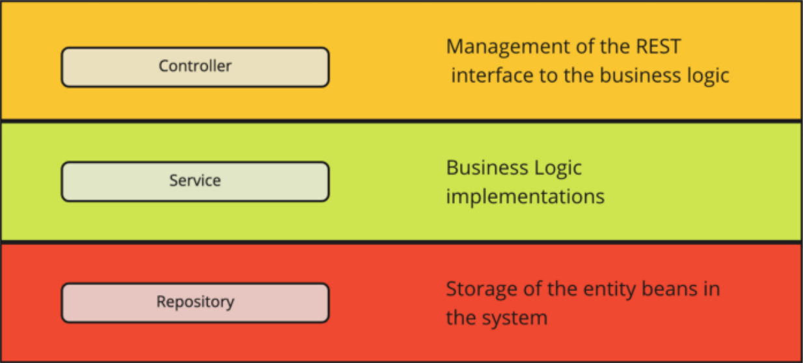
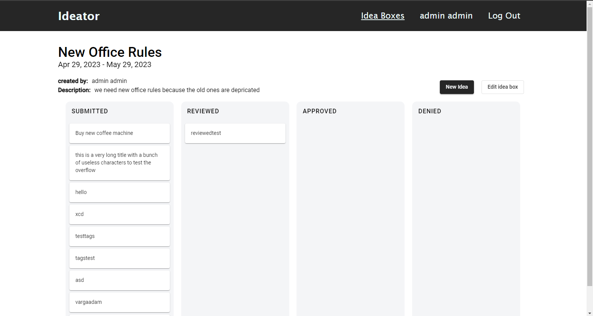
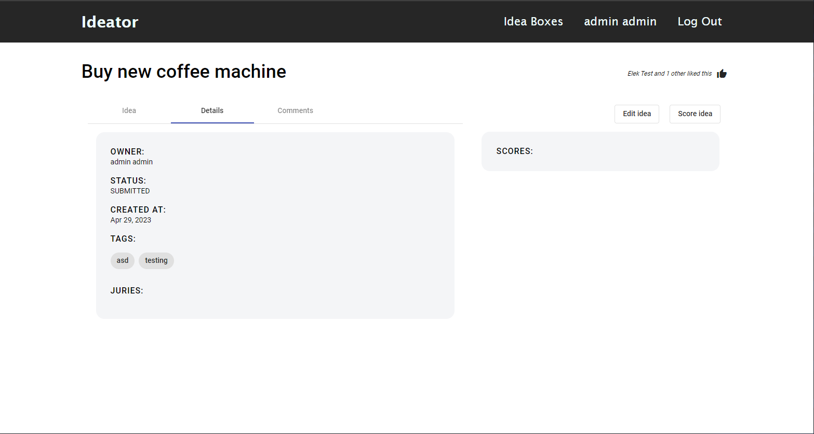
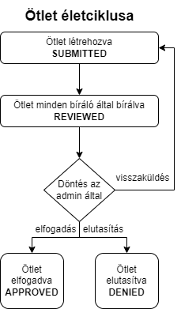

# Multitenant ötletkezelő alkalmazás Spring alapokon - Beszámoló

Önálló laboratórium 2 - 2022/23/2

Varga Ádám Marcell

Konzulens: Forstner Bertalan

<hr>

## **Tartalom**

- [Bevezetés](#bevezetés)
  - [Motiváció](#motiváció)
  - [Megvalósítandó feladat](#megvalósítandó-feladatok)
- [Architektúra](#architektúra)
- [Felhasznált technológiák](#felhasznált-technológiák)
  - [Angular](#angular)
  - [Spring Boot (Kotlin)](#spring-boot-kotlin)
  - [MySQL](#mysql)
- [Front-End](#front-end)
  - [Nézetek](#nézetek)
- [Back-end](#back-end)
- [Továbbfejlesztési lehetőségek](#továbbfejlesztési-lehetőségek)
- [Összefoglalás](#összefoglalás)

<div style="page-break-after: always;"></div>

## **Bevezetés**

### **Motiváció**

Azért választottam ezt a témát, olyan témával akartam foglalkozni, amit továbbvihetek Diplomaterv 1 illetve 2 tárgyakra, mert eég nagy ahhoz, hogy 3 féléven keresztül tudjak benne mivel foglalkozni.

Emellett a témával lehetőségem van olyan dolokat kipróbálni, amikkel eddig nem foglalkoztam. Ilyen például a Spring Boot rendszer megismerése és a multitenant architektúra implementálása.

Emellett az megvalósítandó alkalmazás, ami egy akár ipari környezetben is használható ötletkezelő rendszer fejlesztését is érdekes feladatnak találtam, hiszen alapjaiban véve hasonló felépítésű (csak más célt szolgáló) rendzsereket ma már a szoftverfejlesztő cégek többsége használ a mindennapokban a feladatok kiosztásában. (Jira, Redmine, Trello)

### **Megvalósítandó feladatok**

A félévben a fő célként azt tűztem ki, hogy az alkalmazás alapjait fektetem le, hogy a Diplomaterv 1 illetve 2 tárgyak keretében a már működő rendzsert tudjam továbbfejleszteni új, speciálisabb feature-ökkel, modulokkal.

Ez alapján a félévre tervezett feladatok a következők voltak:

**Rendszer**

Az alkalmazás alapvetően 3 felhasználót támogat, a **USER**-t, a **JURY**-t és az **ADMIN**-t. Ezek a felhasználóknak különböző jogosultságaik vannak, amikkel az alkalmazás különböző részeihez férnek hozzá.

- **USER**

  A USER felhasználó az oldalon limitált képességekkel rendelkezik. A listázott ötletdobozokat látja, amiket meg tud nyitni. Ezekbe az ötletdobozokba létrehozhat új ötleteket. A saját ötletét szerkesztheti, illetve töröleti, de más ötletét csak megnyitni tudja. Az ötleteket Like-olhatja, illetve ha már Like-olta, akkor a Like-ot visszavonhatja. Az ötlet kommentjeit Like/Dislikeolhatja (a sajátját is) illetve új kommentet is létrehozat egy adott ötlethez. A saját kommentjét szerkeszteti.

  Ezen felül hozzáfér a User oldal első részéhez, ami listázza a saját ötleteket és kommenteket.

- **JURY**

  A JURY felhasználónak már több leetősége van interakcióba lépni az oldallal. A JURY felhasználók megkapják a USER felhasználók jogait, illetve új funkciókhoz is hozzájutnak.

  - Ötletdobozok létrehozása
  - Ötletdobozokba érkező ötletek bírálása

  Ezen felül a JURY felhasználók hozzáférnek még a User oldal egy új részéhez is, ami listázza azokat az ötleteket, amikhez a felhasználó hozzá van rendelve mint kötelező bíráló, illetve azokat az ötleteket, amikhez már készített bírálatot.

- **ADMIN**

  Az ADMIN felhasználó az oldal Superusere, tehát minden joga megvan. Létrehozhat, szerkeszthet ötletdobozokat, a benne lévő ötleteket, kommenteket. A felhasználóknak ő állítja be a jogosultságait

**Biztonság**

A rendszernek mind Front-End-en, mind Back-end-en meg kell valósítani biztonsági intézkedéseket, amikkel csak a megfelelő jogusultságú felhasználók érhetnek el a jogaiknak megfelelő funkciókat.

<div style="page-break-after: always;"></div>

## Architektúra

Az alkalmazást webes környezetben valósítottam meg, és mivel több feladatot is ellát (illetve még a jövőben bővítve is lesz), ezért 3 rétegű architektúra megvalósítása mellett döntöttem.

**Megjelenítési réteg:** Angular 14

**Üzleti logikai réteg:** Spring Boot Kotlin nyelven

**Perzisztencia:** MySQL Adatbázis

Mind a kliens oldali Angular alkalmazásban, mind a szerver oldali Go alkalmazásban
törekedtem az adott keretrendszer által diktált struktúrák és konvenciók megtartására.

<hr>

Ez a Back-End rétegben megvalósult. A szerver megvalósítja a Controller-Service-Repository mintát.



A Controllerben vannak összegyűjtve a REST hívások, ezek a függvények hívják tovább az üzleti logikának a megvalósított függvényeit.

A Service-ben vannak az implementált függvények, amiket a Controller hív. Itt történik az adatok összeállítása, kiértékelése, a biztonság egy része.

A Repository mappa nyújtja a hidat az adatbázis és a JPA között.

<hr>

Front-End-en is törekedtem a helyes mappaszerkezet létrehozására, de az alkalmazás hamar túlnőtt az elsőre becsült méretén, így itt nem teljesült maradéktalanul a komponens alapú alkalmazás fejlesztés. Több komponens van amiket kisebb változásokkal újraimplementáltam. Ezeket általánosabb komponensekké ki lehetne vezetni.

<div style="page-break-after: always;"></div>

## **Felhasznált technológiák**

### **Angular**

**Angular**
Az Angular egy webes keretrendszer, amit a Google fejleszt. SPA
(Single Page Application) létrehozására lett kitalálva, ami azt jelenti,
hogy a megjelenített nézeteket nem a szerver generálja és statikus
oldalakként küldi a kliens számára, hanem kliens oldalon kerülnek
generálásra, és ezek a generált oldalak és komponensek
dinamikusan vannak beillesztve a DOM-ba (Document Object
Model). Ennek köszönhetően az SPA alkalmazások nagyon gyorsak
és „mozgékonynak” tűnhetnek a végfelhasználók számára.
A fejlesztésük is egyszerű, mivel az Angular is komponenseken alapul. A komponensek kisebb
alkotóelemei az oldalnak, amik akár önállóan is működhetnek. Ezekből a kisebb komponensekből
áll elő az oldal. Ezeket a komponensek úgy vannak tervezve, hogy újra felhasználhatóak legyenek
az alkalmazás több részében is, így jelentősen kevesebb (akár semmiféle) kódismétlést tartalmaz
az oldal forráskódja

**Angular Material**

Az Angular Material szintén a Google által fejlesztett könyvtár, ami az Angular
alkalmazásokhoz biztosít különböző előre létrehozott komponenst, amikkel a fejlesztés még
gyorsabb és egyszerűbb. A könyvtár ezen felül egy nagyon jól definiált material designt is nyújt,
ami könnyen használható a saját komponensek stílusozására is.
Az alkalmazásban több komponens is Angular Material komponens, vagy abból lett átalakítva.
Az egyedi stílusozást SCSS segítségével valósítottam meg, ahol erre szükség volt

### **Spring Boot (Kotlin)**

//TODO

### **MySQL**

A MySQL egy többfelhasználós, többszálú relációs
adatbázis kiszolgálásához használható szerver. A kora
ellenére még most is az egyi legelterjedtebb adatbázis
szerver, ami gyorsaságának, és nyílt forráskódjának
köszönhető. A MySQL szerverek fejlesztése nagyon
költséghatékony, emiatt rengeted keretrendszer
támogatja a MySQL könnyű integrálását és ez alól a Go
sem kivétel.

<div style="page-break-after: always;"></div>

## **Front-End**

### **Nézetek**

Az alkalmazás kliens oldala több nézetet is tartalmaz, amik között a felhasználó (a jogaitól függően) szabadon navigálhat.

**Login/Register oldal**

Ez az odlal fogadja először a felhasználót. Az alkalmazás használata felhasználói fiókhoz kötött, ha nem vagyunk belépve akkor az alkalmazás funkcióit nem tudjuk használni, az odlalakat nem tudjuk látogatni. Ha a felhasználó rendelkezik fiókkal, akkor az email címével és jelszavával be tud lépni az alkalmazása. Ha még nem rendelkezik fiókkal, akkor a Register gomb megnyomásával egy regisztráló oldalra irányítódik át, ahol a vezetéknév, keresztnév, email és jelszó megadását követően tud fiókot létrehozni.


**Ötletdoboz listázó oldal**

Ez az oldal tekinthető az alkalmazás főoldalának. Itt láthatóak az aktív ötletdobozok, melyekbe bárki ötletet írhat. Ezt a listázó doboz jobb fölső sarkában található **Create** gombbal tehetjük meg. A listázott ötletdobozokból kereshetünk is a keresőmező használatával, illetve a keresődoboz alján található lapozóval lapozhatunk is a találatok között, ha nem férnek ki az ötletdobozok egy oldalra. Az oldalak számát a felhasználó szabhatja meg (4, 8 illetve 12 ötletdoboz).

Ha adminként vagyunk belépve, akkor megnyithatjuk az ötletdobozokat menedzselő felületet.


**Ötletdoboz menedzselő oldal**

Ez egy egyszerő listázó oldal, ahol az adminok gyorsan és egyszerően hajthatnak végre műveleteket az ötletdobozokon.

A táblázatban az ötletdobozokat gyorsan törölhetjük, illetve megnyithatjuk a szerkesztő oldalukat. A törés gomb megnyomásakor egy felugró ablak figyelmeztet, hogy biztosan törölni akarjuk-e az ötletdobozt, és annak minden ötletét, az ötletek minden kommentjét.


**Ötletdoboz Create/Edit**

Ez a felület két célt szolgál. Új ötletdobozt lehet itt felvenni, vagy egy már meglévő ötletdobozt szerkeszteni.

Az ötletdobozoknak Címet, leírást, kezdeti és zárási időpontot lehet adni. Ha admin felhasználóként vagyunk bejelentkezve, akkor ezen kívül még megjelenik egy táblázat, ami - hasonlóan mint az ötletdoboz menedzselő felületnél - egy gyors módot biztosít az ötletek szerkesztésére és törlésére.


**Ötletdoboz**

Ezen a felületen láthatunk egy adott ötletdobozt és annak adatait, illetve a benne már leadott ötleteket. Az ötletek 4 nagyobb kategóriába sorolhatók.

- **SUBMITTED**

  Ezek a friss ötletek. Amikor egy felhasználó létrehoz egy ötletet, akkor az ebbe a kategóriába kerül.

- **REVIEWED**

  Ebbe a kategóriába akkor kerülnek az ötletek, ha az összes hozzárendelt bíráló lepontozta az ötletet. Ez az áthelyezés automatikus.

- **APPROVED/DENIED**

  A review során összegyűlt pontok alapján az admin dönthet úgy, hogy az adott ötlet megfelelő, ekkor elfogadja az ötletet. Ebben az esetben az ötlet átkerül az APPROVED státuszba. Ellenkező esetben az ötlet a DENIED státuszba kerül. Ez az áthelyezés nem automatikus.

Az admin felhasználó az ötletek státuszát direktben is állíthatja.

A felületen a már megszokott helyen létrehozhatunk új ötletet az ötletdobozba, illetve admin jogosultsággal az ötletdoboz szerkesztőfelülete is megnyitható.



**Ötlet Create/Edit**

Hasonlóan mint az Ötletdoboznál, ez a felület és két célt szolgál, ötlet létrehozását és módosítását. A felületetn megadható az ötlet címe, leírása. Hozzáadhatunk már létező Tag-eket, illetve új Tag-eket is felvehetünk. Az ötlethez itt tudunk hozzárendelni Bírálókat.


**Ötlet**

Ez a felület 4 alrészből áll, ezek: az Idea, a Details, a Comments illetve a Scores rész. Az első három részből a felületen mindig csak 1 látható, a Scores rész azonban a képernyő jobb szélén mindig megjelenik.

Az ötleteket lehet like-olni is a jobb fölső sarokban. Itt a like gomb mellett láthatjuk, hogy hány ember like-olta eddig és az utolsó likeoló nevét is láthatjuk. Abban az esetben, ha az utolsó lájkoló mi vagyunk, akkor a felület a "You"-t fogja kiírni.



- **Idea:**
  Az Idea fülön található a leírás, illetve a későbbiekben ide lehet még több adatot felvinni.

- **Details:**
  Itt találhatóak az alap adatai az ötletnek, mint például az hogy ki csinálta, mikor, és hogy éppen milyen státuszban van az ötlet. Itt látható, hogy milyen Tag-ekkel van ellátva, illetve mely bírálók vannak az ötlethez adva.

- **Comments:**
  Itt láthatóak az ötlethez fűzött kommentek. Ez az oldal részletesebb mint a többi, így ez a következő részben részletesen kifejtem.

**Comment**

Ez az aloldal arra hívatott, hogy az ötletekre lehessen kommenteket írni. Ezt az aloldal tetején lévő szövegdobozból tudjuk megtenni. Alatta láthatjuk a már létező kommenteket. Ezeket a kommenteket lehet like-olni. itt a likeolás és annak kiírása ugyanúgy működik, mint az ötleten lévő like rendszer. A felhasználó a saját maga által írt kommenteket tudja szerkeszteni. Ekkor a kommentnél megjelenik egy "Edited" szöveg, jelezve, hogy a komment szerkesztve lett. Az admin felhasználók bárkinek a kommentjét szerkeszthetik.


**Score**

Ez az oldal valamilyen formában létrejött, de a kitűzött céloknak majdnem semmilyen formában nem felel meg, így ennek a szolgáltatásnak a fejlesztésére csak a következő félévben lesz lehetőség.

<div style="page-break-after: always;"></div>

## **Back-End**

Ahogy már említettem, az alkalmazás szerver odlala egy Spring Boot alkalmazás, amit Kotlin nyelven írtam. Az alkalmazás követi a Spring jól bevált struktúráját, azaz megtalálhatóak a Controllerek, a modellek, a repositoryk és a servicek. Ezen felül két mappa is a struktúra részét képezi, a mapperek és a security

### **Controller**

Itt találhatók az endpontok, amiken keresztül az alkalmazás fogadja a kéréseket. A kérések az /api/\*\*\* url-en érhetőek el. Ezek az endpontok kérés érkezése esetén a service mappában implementált függvényeket hívják meg. Azok az endpontok amik listát adnak vissza, rendelkeznek szűrési és paginálási lehetőségekkel is. Ilyen például az ötletdobozok listázása.

```
@GetMapping("/idea-box")
    fun getIdeaBoxes(
        @RequestParam("s", defaultValue = "") s: String,
        @RequestParam("sort", defaultValue = "") sort: String,
        @RequestParam("page", defaultValue = "1") page: Int,
        @RequestParam("items", defaultValue = "12") items: Int
    ): ResponseEntity<*> {
        var direction = Sort.unsorted()
        when(sort) {
            "newest" -> direction = Sort.by(Sort.Direction.DESC, "startDate")
            "oldest" -> direction = Sort.by(Sort.Direction.ASC, "startDate")
            "closing" -> direction = Sort.by(Sort.Direction.ASC, "endDate")
        }
        return ideaBoxService.getIdeaBoxes(s, PageRequest.of(page-1, items, direction))
    }
```

### **Model**

Az alkalmazás modell szerkezete nem egyedi módon követi a DAO-DTO mintát. Ez azt jelenti, hogy az alkalmazásban 3 féle modell típus tartozik minden objektumhoz, ezek a **model**, a **dto** és a **slimDto**.

- **Model**

  Ez írja le a legbővebben az objektumokat, és ebben a formában kerülnek az objektumok tárolásra az adatbázisban is. Ebben a leírásban találhatók az objektumok összekapcsolására szolgáló adatbázis kapcsolatok is, amiket a JPA választ majd szét, hogy relációs adatbázisba lehessen ültetni.

  A JPA segítségével könnyen kezelhetők az objektumok közötti egy-egy, egy-több, több-több kapcsolatok. Erre egy példa:

  ```
  @OneToMany(mappedBy = "idea", fetch = FetchType.LAZY, cascade =   [CascadeType.ALL], orphanRemoval = true)
  var comments: MutableList<Comment>?,

  @ManyToOne
  @JoinColumn(name = "ideaBox_id")
  var ideaBox: IdeaBox,
  ```

  Ebben a példában például egy több-több kapcsolatot láthatunk, ahol az ötlethez kapcsoljuk a hozzá tartozó kommenteket. Itt látható, hogy az ötlet törlésénél a kommentek is törlésre kerülnek. Ezen felül egy egy-több kapcsolat is látható, amikor az ötletdobozok több ötletet is tartalmazhatnak, de egy ötlet csak egy ötletdobozhoz tartozhat.

- **Dto**

  A Dto (Data Transfer Object) feladata, hogy ne minden adat kerüljön kiküldésre a kliens felé, hanem csak azok, amikre valóban szükség van, illetve, hogy a kényes adatok ne kerüljenek ki. Ez egy védelmet is biztosít az adatbázisnak.

- **SlimDto**

  A SlimDto-k feladata az, hogy a Dto-knál küldött kapcsolódó adatok ne az egész objektumot küldjék, hanem csak a feltétlen szükséges adatokat, amikkel lekérhető a szerverről a teljes objektum, ha erre szükség van. Ebben általában csak id-k, illetve 1-2 listázás és nevesítés céljából használt adat utazik. Ebben az adattípusban már nincs utalás az esetleges al-objektumaira, így nem keletkezik végtelen utalás az adatok között.

### **Mapper**

A Mapperben olyan függvények találhatóak, amik a különböző modelltípusokon végeznek konverziókat. 4 Féle konverziót valósítottam meg.

- modelToDto
- modelToSlimDto
- dtoToModel
- slimDtoToModel

### **Repository**

A repository mappában vannak azok a kódok, amik segítségével a JPA az egymásba ágyazott objektum struktúrából leképez egy relációs adatbázisba ültethető adatmodellt. A modellben az annotációkkal ellátott kapcsolatokból kapcsolótáblák képződnek. Ezen felül szűrési és keresési függvények is létrehozhatók itt.

Erre példa a UserRepository findJuries függvénye, ami a felhasználók közül visszaadja azokat, akiknek a szerepköre bíráló vagy admin.

```
@Query("SELECT u FROM User u WHERE u.role='Jury' OR u.role='ADMIN'")
    fun findJuries(): List<User>
```

### **Security**

Az alkalmazás biztonságáért a spring security és JWT tokene alkalmazása felel. A felhasználó bejelentkezéskor illetve regisztrációkor kap egy JWT-t, amit eltárol. A belső rendszer minden endpointja csak akkor látogatható, ha a felhasználó rendelkezik érvényes JWT-vel. Bizonyos endpoint csak akkor látogatható, ha a felhasználó jogosultsági köre is engedélyt ad rá (a bírálást csak jury és admin felhasználó végezheti).

### **Service**

A service rétegben vannak az alkalmazás által használt függvények implementációi. Ezek hívódnak meg amikor az bejövő hívás érkezik az alkalmazásban. Itt hívódnak az adatbázis műveletek, illetve itt is vannak biztonsági intézkedések. (Csak a bejelentkezett felhasználó szerkeszthet egy adott commentet).

```
fun editComment(comment: CommentSlimDto): ResponseEntity<*> {
        val authentication = SecurityContextHolder.getContext().authentication
        if(comment.owner.email != authentication.name) {
            return ResponseEntity(
                WebResponse(
                    code = HttpStatus.UNAUTHORIZED.value(),
                    message = "You dont have permission to do that!",
                    data = null
                ),
                HttpStatus.UNAUTHORIZED
            )
        }
        val originalComment = commentRepository.findById(comment.id).orElse(null)
            ?: return ResponseEntity(
                WebResponse(
                    code = HttpStatus.NOT_FOUND.value(),
                    message = "Cannot find Comment with this id $comment.id!",
                    data = null
                ),
                HttpStatus.NOT_FOUND
            )

        originalComment.isEdited = true
        originalComment.text = comment.text

        return ResponseEntity.ok(
            WebResponse<CommentDto>(
                code = HttpStatus.OK.value(),
                message = "Comment successfully edited!",
                data = commentMapper.modelToDto(commentRepository.saveAndFlush(originalComment))
            )
        )
    }
```

<div style="page-break-after: always;"></div>

## **Továbbfejlesztési lehetőségek**

Az alkalmazás egy jelentős része, a pontozás nem úgy valósult meg, mint ahogy azt az elején terveztem. Illetve úgy valósult meg, mivel az elején sokkal kisebbre terveztem, mint amekkora része ez az alkalmazásnak. Emiatt ez a rész befejezetlen maradt ennek a félévnek a végére. A tervek azonban készen állnak, hogy implementáljam a következő (diplomaterv 1) félévben.

### **Ötletdoboz életciklus**

Az egész rendszer életciklusát újra kellett gondolni az első tervezés után. Jelenleg a rendszerben az ötletdobozoknak és a pontozásnak nincsen végcélja.

A következő félévben a következő rendzsert szeretném implementálni:


Az ötletdoboz életciklusa a következő lesz:

- **Ötletdoboz létrehozás**

  Ahogy a jelenlegi rendzserben is, az ötletdobozt el lehet majd készíteni, névvel, leírással és egyéb adatokkal ellátni.

- **Kötelező bírálók beállítása**

  Az ütletdoboznak be lehessen állítani kötelező bírálókat, akik majd az adott dobozba érkező ötleteket bírálják. Ezen felül ötletenként lehet majd egyéb bírálókat is felvenni, de ezek a bírálók, amik itt beállításra kerülnek alapértelmezetten szerepelni fognak minden beérkező ötletnél.

- **Bírálási szempontok beállítása**

  Az ötletdobozhoz egy egyedi bírálási szempontokat tartalmazó bírálólapot kell majd összeállítani az adminnak. Ebben a bírálólapban minden bírálási szempontnak szerepelni kell, és minden bírálási szemponthoz egy bírálási módszert lehet majd hozzárendelni (csillagos, csúszkás, szöveges). Ezek után az ötletdoboz aktívvá válik, és megnyílik a felhasználóknak az ötletgyűjtésre

- **Beérkező ötletek bírálása**

  A beérkezett ötletek a bíráló bizottság tagjainál megjelenik, ha kötelező bírálói az ötletnek. Ők az ötletek bírálását elvégzik, és az Ötlet életciklusának a végén az ötlet valamelyik sávba kerül. Erről részletesebben az [ötlet életciklusában](#ötlet-életciklus) írok.

- **Ötletdoboz lezárása**

  Az ötletdoboz határideje után már nem fogad több ötletet, azaz lezáródik. Az beérkező ötletek még bírálásra kerülnek, de visszaküldésre már nincs lehetőség.

- **Eredmények**

  Az elbírált és elfogadott ötletek kihirdetésre kerülnek.

### **Ötlet életciklus**

Az ötletek tervezett életciklusa az alébbi képen látható:



- **Ötlet létrehozva**

  Az ötletet a felhasználó létrehozta. Ilyenkor az ötlethez hozzákerülnek a szülő ötletdobozából a kötelező bírálók, de a felhasználó maga is adhat hozzá új bírálókat.

- **Ötlet minden bíráló által bírálva**

  Ha az ötletet minden hozzárendelt bíráló lepontozta, akkor az automatikusan átkerül a REVIEWED oszlopba és ADMIN beavatkozásra vár

- **Döntés**

  Az admin dönthet arról, hogy az ötletet elfogadja, elutasítja vagy visszaküldi. Amennyiben elfogadja vagy elutasítja, akkor az ötlet életciklusa véget ér. Ha visszaküldi javításra, akkor visszakerül a submitted státuszba, és a pontozások lekerülnek róla.

Az ötleteknél a SUBMITTED és REVIEWED státuszban ha a felhasználó szerkeszti az ötletet, akkor arról az összes eddigi pontozás lekerül.

Az ötletek bírálásánál az admin egy összesítő oldalon látja a szempontokhoz összegyűlt átlagos értékeket, esetleg ábrán, grafikonon, illetve a szöveges hozzászólásokat. Ezek alapján hozza meg a végleges döntést.

<div style="page-break-after: always;"></div>

## **Összefoglalás**

A félév során az alapvető alkalmazás elég nagy részét sikerült implementálni. A hátralévő pontozási rendszer nem kalkulált méretei miatt az a rész nem lett befejezve.

A félév során sokat tanultam mind front-end, mind backend tervezés kapcsán. A back-end alkalmazásom struktúrájában jól működik, és könnyű továbbfejleszteni. Itt rengeteget tanultam a Spring keretrendszerről hiszen ez volt az első komolyabb alkalmazás, amit írtam benne. A spring security is új rendszer volt, de a félév végére sikerült belemélyednem és megvalósítanom egy implementációt.

Front-end részről az alkalmazás vizonyos részei (mivel előre nem kalkuált méreteket öltött) a félév végére kezdtek összecsúszni, így a front-end-re egy refaktorálás ráfér, ahol a különböző felelősségek jobban szét válnak akár modulok formályában is
